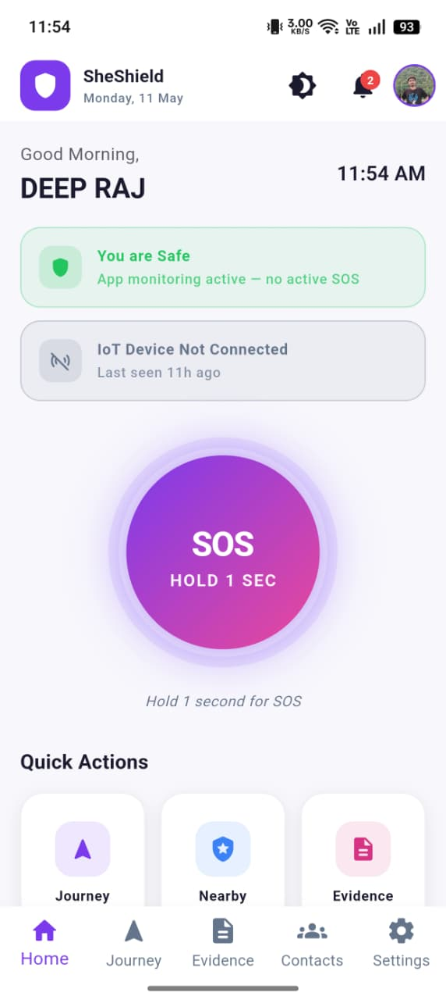
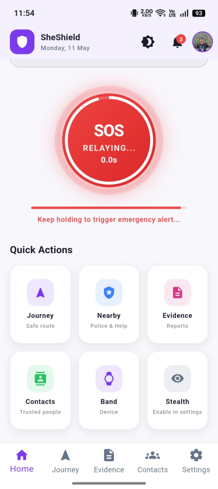
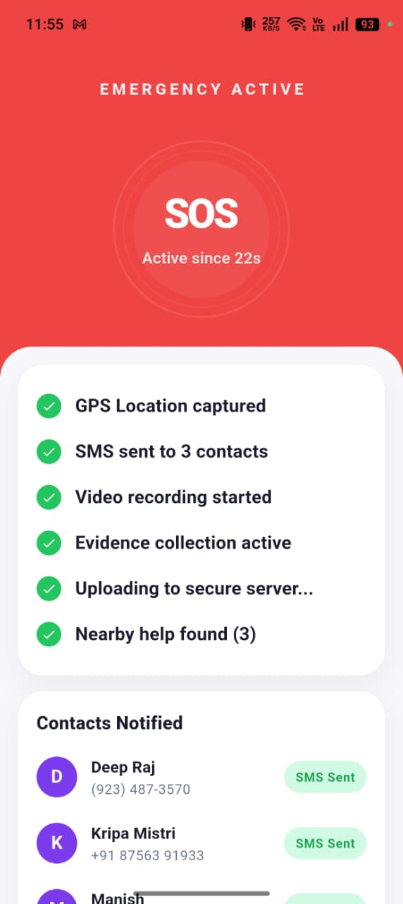
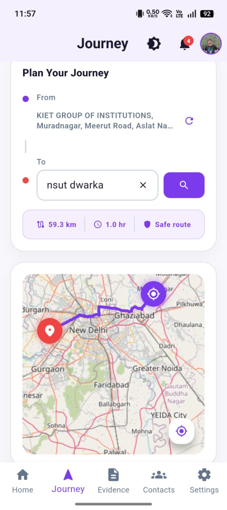
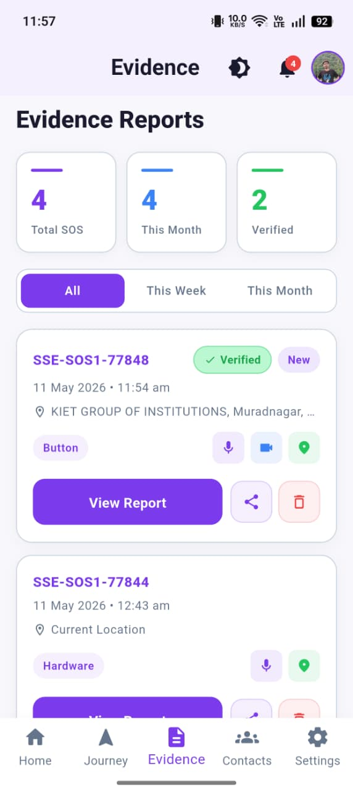
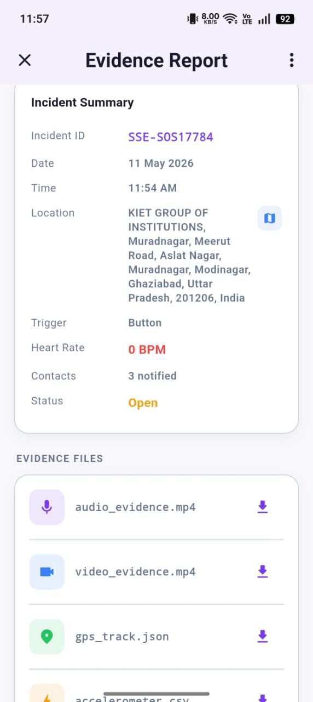
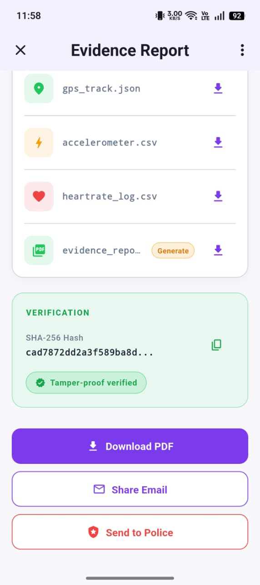
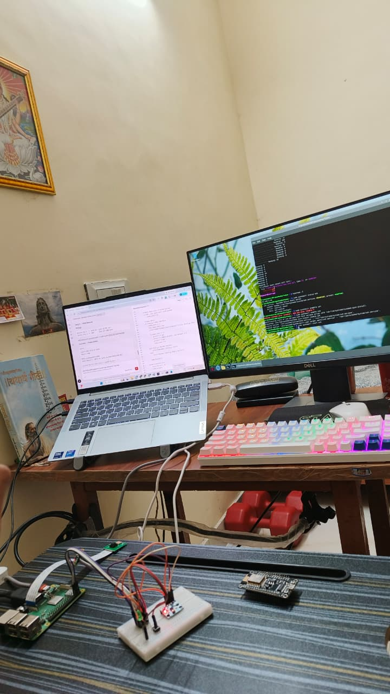

<div align="center">

<br/>

<pre>
 ███████╗██╗  ██╗███████╗  ███████╗██╗  ██╗██╗███████╗██╗     ██████╗
 ██╔════╝██║  ██║██╔════╝  ██╔════╝██║  ██║██║██╔════╝██║     ██╔══██╗
 ███████╗███████║█████╗    ███████╗███████║██║█████╗  ██║     ██║  ██║
 ╚════██║██╔══██║██╔══╝    ╚════██║██╔══██║██║██╔══╝  ██║     ██║  ██║
 ███████║██║  ██║███████╗  ███████║██║  ██║██║███████╗███████╗██████╔╝
 ╚══════╝╚═╝  ╚═╝╚══════╝  ╚══════╝╚═╝  ╚═╝╚═╝╚══════╝╚══════╝╚═════╝
</pre>

### **Her safety. Her shield. Always on.**

*A production-grade Flutter Android app delivering real-time emergency response,*  
*wearable integration, and silent SOS orchestration — built for the women who need it most.*

<br/>

[](https://flutter.dev)
[](https://dart.dev)
[](https://firebase.google.com)
[](https://developer.android.com)
[](LICENSE)
[]()

<br/>

[🚨 SOS Flow](#-sos-trigger-flow) · [🏗️ Architecture](#%EF%B8%8F-architecture) · [🚀 Quick Start](#-quick-start) · [📡 Bluetooth Protocol](#-bluetooth-protocol-raspberry-pi-3b) · [🔐 Security](#-security)

<br/>

</div>

---

## 🎯 What is SheShield?

SheShield is a **production-grade women's safety application** engineered for real-world emergency scenarios. When danger strikes, SheShield responds in seconds — silently capturing evidence, alerting trusted contacts, and coordinating multi-layered emergency response without requiring the user to navigate complex menus.

> Built on Clean Architecture principles, SheShield is designed to work under pressure: every SOS step is non-blocking, failure-resilient, and independently logged.

<br/>

## ✨ Core Capabilities

| Feature | Description |
|---|---|
| 🆘 **Multi-Trigger SOS** | Button hold, voice command, shake gesture, bracelet tap, audio scream detection |
| 📍 **Real-Time GPS** | Live location tracking with reverse geocoding and location sharing links |
| 📹 **Auto Evidence Capture** | 30-second video recording + SHA-256 tamper-proof hash on SOS trigger |
| 🔵 **RPi 3B+ Bracelet** | Raspberry Pi 3B+ powered wearable for discreet SOS triggering and haptic feedback |
| 👮 **Nearby Police** | OSM-powered live map of nearest police stations |
| 🧳 **Journey Mode** | Geofenced travel monitoring with check-in alerts |
| 🧮 **Stealth Mode** | App disguised as a functional calculator |
| 📋 **Evidence PDF** | Auto-generated tamper-proof PDF report for each SOS event |

<br/>

---

## 🏗️ Architecture

SheShield follows **strict Clean Architecture** with clear separation of concerns across every layer.

```
lib/
├── core/
│   ├── constants/         # app_colors.dart · app_strings.dart · app_constants.dart
│   ├── theme/             # app_theme.dart (Material 3)
│   └── utils/             # logger.dart · validators.dart · extensions.dart
│
├── models/                # UserModel · ContactModel · SosEventModel
│                          # BraceletModel · EvidenceModel
│
├── services/              # Singleton services (GPS, BLE, SOS, SMS, Video...)
├── providers/             # ChangeNotifier state (AppState, Auth, SOS, Bracelet...)
├── screens/               # Full-page UI screens
└── widgets/               # Reusable, isolated UI components
```

### Design Principles

- **Zero Hardcoding** — All strings in `app_strings.dart`, all colors in `app_colors.dart`
- **Singleton Services** — GPS, Bluetooth, and SOS orchestration persist across navigation
- **Async-Safe** — Every I/O operation is wrapped in try/catch with structured logging
- **Failure-Resilient SOS** — Each of the 10 SOS steps can fail without blocking the next
- **Isolate-Heavy** — SHA-256 hashing and PDF generation run in separate Dart isolates
- **Provider Pattern** — `ChangeNotifier` for reactive, testable UI state

<br/>

---

## 🚨 SOS Trigger Flow

The 10-step SOS sequence executes automatically the moment a trigger fires. Each step is **non-blocking** — a network failure won't prevent the PDF from generating.

```
 TRIGGER ──────────────────────────────────────────────────────────────────►
 (Button · Voice · Audio · Shake · Bracelet)

  Step 1   📍  Capture GPS coordinates              [location_service]
  Step 2   📞  Send SMS to all emergency contacts   [sms_service]
  Step 3   📹  Begin 30-second video recording      [video_service]
  Step 4   ⏱️  Wait 30s for recording to complete
  Step 5   🔐  Generate SHA-256 hash (Isolate)      [evidence_service]
  Step 6   ☁️  Upload video to Firebase Storage     [video_service]
  Step 7   💾  Save SOS event to Firestore          [firestore]
  Step 8   🔔  Push FCM notification to contacts    [notification_service]
  Step 9   📟  Send commands to RPi 3B+ bracelet    [bluetooth_service]
             └─ VIBRATE_SOS · LED_ON · BUZZER_ON
  Step 10  📄  Generate PDF evidence report (Isolate) [evidence_service]

 ◄─────────────────────────── All steps run concurrently where possible ───
```

<br/>

---

## 🔧 Services Reference

All services follow the **singleton pattern** and persist across the full app lifecycle.

| Service | Responsibility | Status |
|---|---|---|
| `LocationService` | GPS coordinates + reverse geocoding + sharing | ✅ Complete |
| `BluetoothService` | Raspberry Pi 3B+ bracelet pairing, commands & data streams | ✅ Complete |
| `SOSService` | Full 10-step SOS orchestration engine | ✅ Complete |
| `SMSService` | Emergency SMS dispatch to all contacts | ✅ Complete  |
| `VideoService` | Camera recording + Firebase Storage upload | ✅ Complete |
| `EvidenceService` | SHA-256 hashing + PDF generation (Isolates) | ✅ Complete |
| `NotificationService` | FCM push notifications to trusted contacts | ✅ Complete |
| `VoiceService` | Voice trigger detection ("Help!") | ✅ Complete |
| `AudioService` | Scream/distress audio detection | ✅ Complete |
| `JourneyService` | Geofencing + journey mode tracking | ✅ Complete |
| `PlacesService` | OSM Overpass API for police stations |  ✅ Complete |
| `StorageService` | SharedPreferences persistence wrapper | ✅ Complete |

<br/>

---

## 📱 Screens & Widgets

### Screens

| Screen | Purpose | Status |
|---|---|---|
| `SplashScreen` | Auth check, service initialization | ✅ Complete |
| `LoginScreen` | Email/password Firebase auth | ✅ Complete |
| `SignupScreen` | New user registration flow | ✅ Complete |
| `HomeScreen` | Central SOS hub with status overview | ✅ Complete |
| `LocationScreen` | Live map tracking + shareable link | ✅ Complete |
| `ContactsScreen` | Manage emergency contacts | ✅ Complete |
| `NearbyPoliceScreen` | OSM-powered police station map | ✅ Complete |
| `BluetoothScreen` | Raspberry Pi 3B+ bracelet pairing & management | ✅ Complete |
| `PastEmergenciesScreen` | SOS history with video replay + PDF | ✅ Complete |
| `JourneyScreen` | Journey mode setup and geofence config | ✅ Complete |
| `StealthScreen` | Fully functional calculator disguise | ✅ Complete |
| `ProfileScreen` | User settings and account management | ✅ Complete |

### Widgets

| Widget | Purpose | Status |
|---|---|---|
| `SosButton` | 3-second hold trigger with animated countdown ring | ✅ Complete |
| `SafeStatusCard` | Dynamic safe/danger status indicator | ✅ Complete |
| `BraceletCard` | Live BPM + battery display | ✅ Complete |
| `ActionGrid` | 2×2 quick-action navigation grid | ✅ Complete |
| `ContactTile` | Emergency contact list item | ✅ Complete |
| `PoliceStationTile` | Police station result card | ✅ Complete |
| `EvidenceCard` | Past SOS event summary card | ✅ Complete |
| `BottomNav` | 5-tab persistent navigation bar | ✅ Complete |

<br/>

---

## 🚀 Quick Start

### Prerequisites

- Flutter `3.10+` / Dart `3.0+`
- Android Studio with SDK `31+`
- Firebase Project (free Spark tier is sufficient)
- Google Maps API Key

### 1. Clone & Install

```bash
git clone https://github.com/yourusername/sheshield.git
cd sheshield
flutter pub get
```

### 2. Configure Firebase

```bash
# Install the Firebase CLI
npm install -g firebase-tools

# Authenticate and auto-configure for Flutter
firebase login
flutterfire configure
```

### 3. Add Google Maps Key

Open `android/app/src/main/AndroidManifest.xml` and replace the placeholder:

```xml
<meta-data
    android:name="com.google.android.geo.API_KEY"
    android:value="YOUR_GOOGLE_MAPS_API_KEY"/>
```

### 4. Environment Variables

Create a `.env` file in the project root:

```env
FIREBASE_PROJECT_ID=sheshield-prod
GOOGLE_MAPS_API_KEY=your_key_here
OSM_OVERPASS_API=https://overpass-api.de/api/interpreter
```

### 5. Run & Build

```bash
# Development
flutter run

# Production APK (with obfuscation, split per ABI)
flutter build apk --obfuscate --split-per-abi
```

<br/>

---

## 📡 Bluetooth Protocol (Raspberry Pi 3B+)

SheShield communicates with the custom Raspberry Pi 3B+ wearable bracelet over classic Bluetooth Serial.

### Incoming — Bracelet → App

| Command | Trigger |
|---|---|
| `SOS\n` | Bracelet button pressed |
| `SHAKE\n` | Shake gesture detected |
| `HR_DATA:[bpm]\n` | Heart rate reading |
| `BATTERY:[%]\n` | Battery level update |
| `STEALTH\n` | Activate stealth mode |

### Outgoing — App → Bracelet

| Command | Action |
|---|---|
| `VIBRATE_SOS\n` | SOS vibration pattern |
| `LED_ON\n` / `LED_OFF\n` | Status LED control |
| `BUZZER_ON\n` / `BUZZER_OFF\n` | Audible alert control |
| `GET_HR\n` | Request current heart rate |
| `GET_BATTERY\n` | Request battery level |

<br/>

---

## 🔐 Security

| Measure | Implementation |
|---|---|
| **Firestore Rules** | Users can only read/write their own documents |
| **Storage Rules** | Authenticated users only, scoped to their UID |
| **Tamper-Proof Evidence** | SHA-256 hash generated on-device before upload |
| **APK Obfuscation** | All release builds compiled with `--obfuscate` |
| **No Stored Credentials** | Raw passwords never written to disk |
| **Encrypted Transit** | All network calls over TLS/SSL |

<br/>

---

## 🎨 Design System

### Color Palette

```
Primary      #7c3aed  ████  Purple   — Brand, SOS button idle
Safe         #22c55e  ████  Green    — Safe status, success states  
Danger       #ef4444  ████  Red      — Active SOS, critical alerts
Warning      #f59e0b  ████  Amber    — Caution states, pending
Background   #FAFAFA  ████  Off-white
Surface      #FFFFFF  ████  White    — Cards, modals
```

### Typography — Inter

| Style | Size | Weight |
|---|---|---|
| Display Large | 57dp | 400 |
| Headline Large | 32dp | 400 |
| Title Large | 22dp | 500 |
| Body Medium | 14dp | 400 |
| Label Large | 14dp | 600 |

### Component Standards

- **Cards** — 16px border radius, subtle elevation shadow
- **Buttons** — 12px border radius, no elevation
- **Inputs** — 12px border radius, focused ring
- **Tap Targets** — Minimum 56dp (Material 3 accessibility guideline)

<br/>

---

## ⚡ Performance

- Dart **Isolates** for SHA-256 hashing and PDF generation — UI never blocked
- **Stream-based** GPS updates — no polling, minimal battery drain
- Bluetooth service **persists across navigation** — no reconnect overhead
- **Lazy loading** on heavy screens (map, camera, video list)
- `const` constructors used throughout for widget rebuild optimization

<br/>

---

## 📦 Key Dependencies

```yaml
# Firebase
firebase_core: ^2.24.0
firebase_auth: ^4.17.0
cloud_firestore: ^4.14.0
firebase_storage: ^11.6.0
firebase_messaging: ^14.7.0

# Location & Maps
geolocator: ^10.1.0
google_maps_flutter: ^2.5.0
geocoding: ^2.1.1

# Hardware
flutter_bluetooth_serial: ^0.4.0
camera: ^0.10.5+5

# Input Detection
speech_to_text: ^6.3.0
mic_stream: ^1.4.1

# State & Utils
provider: ^6.0.0
crypto: ^3.0.3
pdf: ^3.10.5
```

<br/>

---

## 🧪 Testing

```bash
# Unit tests
flutter test

# Widget tests
flutter test test/widgets/

# Integration tests (Raspberry Pi 3B+ bracelet required)
# Manual testing with physical hardware recommended
```

<br/>

---

## 🪵 Logging

All application events flow through `AppLogger` with structured, color-coded output:

```dart
AppLogger.i('Service initialized');
AppLogger.w('GPS accuracy below threshold');
AppLogger.e('Upload failed', exception, stackTrace);
AppLogger.sosStep(1, 'GPS coordinates captured: 28.6139° N, 77.2090° E');
```

<br/>

---

## 📸 Gallery

### App Screenshots

<div align="center">





<br/><br/>





<br/><br/>



</div>

---

### 🔵 Raspberry Pi Bracelet

<div align="center">



<br/>

Custom Raspberry Pi 3B+ wearable SOS bracelet used for discreet emergency triggering.

</div>

<br/>

---

## 🗺️ Roadmap

- [ ] Dark mode theme support
- [ ] Multi-language localization (Hindi, Tamil, Telugu priority)
- [ ] ML-based threat detection (unusual movement patterns)
- [ ] Community safety heatmap
- [ ] WearOS smartwatch integration
- [ ] Police station verification API
- [ ] Advanced analytics dashboard for guardians

<br/>

---

## 🤝 Contributing

SheShield is a production application. All contributions must adhere to:

1. Strict Clean Architecture — no layer violations
2. 100% error handling — zero uncaught exceptions allowed
3. Comprehensive `AppLogger` instrumentation
4. Unit tests for all business logic
5. Code review approval before merge

<br/>

---

<div align="center">

**Built with purpose. Deployed with care.**

*Every line of code is a promise of safety.*

[]()
[]()
[]()

</div>
